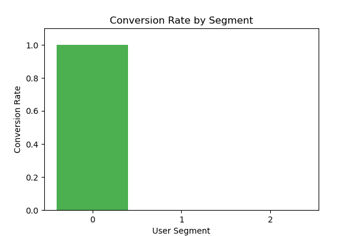
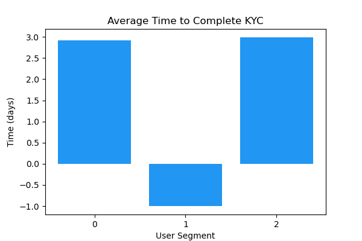
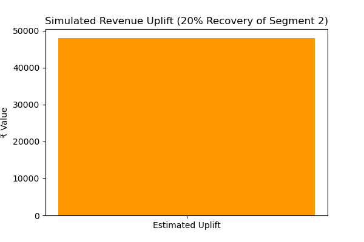

# 🧠 Behavioral Funnel Analytics – Fintech Product Case Study

**Goal:** Identify behavioral drop-offs and simulate revenue recovery in a digital banking funnel.

This Python-based project simulates and analyzes a 4-step user funnel (Sign-Up → KYC → Link → Transaction), merges support logs and transaction data, and segments users using KMeans clustering.

---

## 📌 Business Context

Fintechs often struggle with **user drop-offs** after initial sign-up. This project answers:
- Where are users dropping off?
- Do support requests help?
- What is the potential financial gain if we fix specific friction points?

---

## 📊 Key Highlights

| Insight | Result |
|--------|--------|
| 🧯 Major Drop | 40%+ drop after KYC → Link |
| 🤖 Clustering | 3 user segments: Early Exit, Late Exit, Happy Path |
| 💬 Support Helped? | Slight improvement in time-to-convert |
| 💰 Revenue | Only 1 segment generated ₹218K |
| 📈 What-if Uplift | Recovering 20% of dropouts → +₹48K in revenue |

---

## 🧪 Technical Overview

- 🔁 **Simulated user journeys** across product funnel stages
- 🔗 **Merged multi-source data**: transactions, funnel logs, support logs
- ⚙️ **Engineered features**: time delays, support flag, drop-off logic
- 🧬 **KMeans clustering** for behavior segmentation
- 📈 **Segment-wise analysis** for funnel, support, and revenue
- 📊 **Visuals**: conversion rate, support contact, delay charts, uplift estimate

---

## 🛠️ Tech Stack

`Python`, `Pandas`, `Matplotlib`, `Scikit-learn`, `Jupyter Notebook`

---

## ✅ Real-World Relevance

> “This notebook mimics how a fintech product analyst would diagnose conversion issues and present **insight-backed, revenue-focused recommendations** to the product team.”

---

## 📁 Repo Contents

| File | Description |
|------|-------------|
| `funnel_analysis.ipynb` | Full notebook (clean & well-commented) |
| `requirements.txt` | Python dependencies |
| `visuals/` | Segment comparison charts |
| `README.md` | Project summary and visuals |

---

## 📊 Key Visuals

### ✅ Conversion Rate by Segment

### ✅ Support Contact Rate by Segment

### ✅ Average Time to KYC Completion

### ✅ Simulated Revenue Uplift (20% Recovery of Dropouts)

---

## 📈 Final Takeaway

> Don’t just optimize for **more users**.  
> Optimize for the **right users and right moments** — backed by behavior and revenue data.
